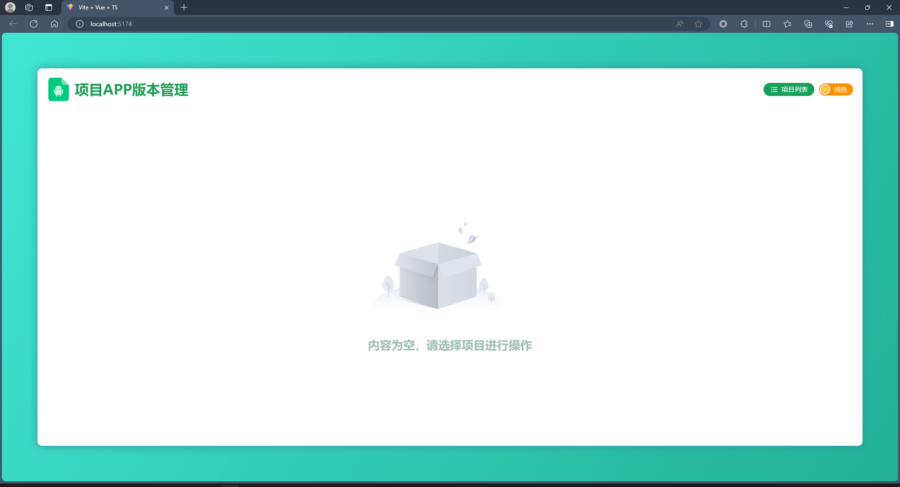
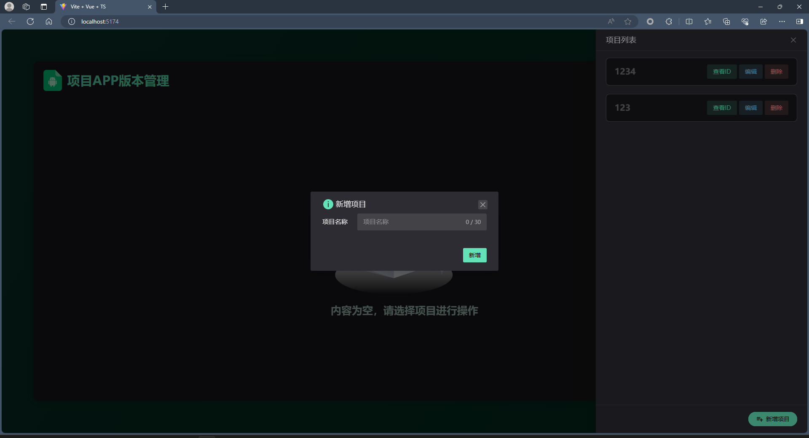
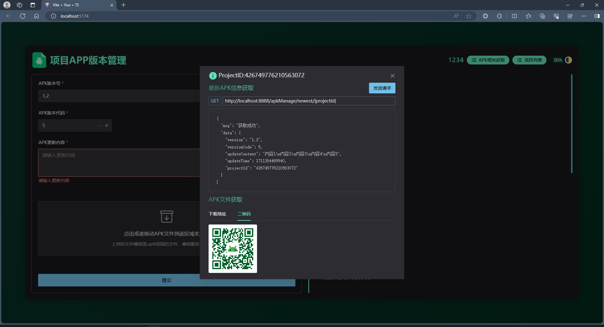
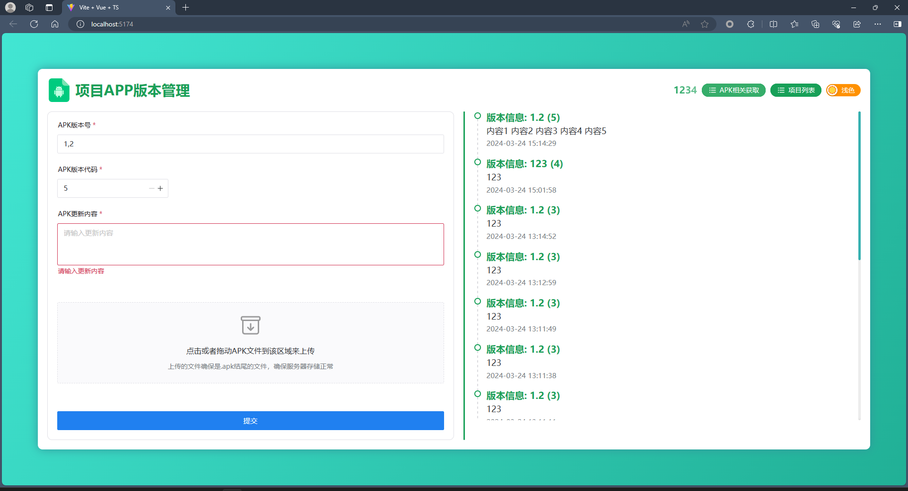

- [引言](#引言)
- [项目能做的工作](#项目能做的工作)
- [Tips ：](#tips-)
- [项目技术栈](#项目技术栈)
  - [Web](#web)
  - [Server](#server)
- [项目部署](#项目部署)
  - [web部署](#web部署)
  - [server 部署](#server-部署)
- [网站图片](#网站图片)


# APKManage（APK文件管理项目）

------

## 引言

好久以前给公司写了个APK管理的平台，因为我们是小外包所以app会变得多，并且还有版本更新所以不好管理，加上我们基本都是安卓项目所以管理不复杂，我就写了个平台来管理每个项目对应的APP文件的上传下载，每个版本号的更新记录这些，当时用的Springboot2+vue2+ElementUI搭的，后续技术栈变更后不想再用之前那一套了，所以刚好放假花一天时间给重构一下。

## 项目能做的工作

创建项目标识来管理对应项目的APK文件的更新记录，能在网站上进行APK文件的相关API测试，能获取APK下载地址和二维码，网站能进行浅色和深色主题的切换，对APK文件的信息上传可以进行查看管理，可对项目列表进行增删改

## Tips ：

> **前后端项目在子分支里面 不在master分支！！！**


## 项目技术栈

### Web

- UI：NaiveUI + vanilla-tilt + vicons
- 语言：TS
- 框架：Vue.js 3
- 构建工具：Vite

### Server

- 框架：Springboot 3.2.0
- 语言：Kotlin 1.9.20
- 构建工具：Gradle+kts
- ORM相关：Mybatis-flex-kotlin + actable

> 项目没做安全验证相关的，秉承着能跑就行的原则，而且本身就是管理个APK作为前后端方便沟通的平台，个人感觉没必要做安全验证其实，后面有时间写死个登录请求就差不多了。

## 项目部署

> 项目是前后端分离的所以会分开说两个端的部署，如果想集成到后端不想两个端口的话打个dis包，然后在server的resource下面建个static文件夹，把dis的内容全部放在这个文件夹里面跑server的jar包访问serverIP:端口/index.html就行了，注意web访问后端的地址别给改成Localhost了，因为web没用router所以不用担心路由问题，就算有使用路由但是不写路由拦截一般直接丢后端也是不用处理的

### web部署

1. 下载项目npm install  基本流程
2. 由于我本身在用这个项目有公司信息所以没上传 `.env.test` 和 `.env.production` 的环境文件，导致build:prod和build:test无法使用，大家自己加上就行，如果你不打test和prod的包其实问题不大，dev就能跑了
3. 修改 `.env.development` 里面的 `VITE_APP_BASE_API` ，这个是后端的服务器请求地址，如果需要prod和test也要记得加上 `VITE_APP_BASE_API` ，因为请求地址是从环境配置文件中读取的
4. npm run dev   开跑就行，没改默认端口，默认端口在5173

### server 部署

1. 下载项目后会提示JDK和Gradle自己设置就行，我用的是JDK17 Gradle 8.4。

2. 默认是跑的dev环境 `application-dev.yaml` ，请在dev文件中设置好自己Mysql的链接信息，链接请指向apk，没有就建一个空的就行，会自动建表

```yaml
# application.yaml
spring:
  config:
    import:
    - classpath:application-dev.yaml
    - classpath:application-test.yaml
  profiles:
    active: dev
```


```yaml
# application-dev.yaml
datasource:
  driver-class-name: com.mysql.cj.jdbc.Driver
  url: jdbc:mysql://xxx:xxx/apk?serverTimezone=UTC&useUnicode=true&characterEncoding=utf8&useSSL=true
  username: xxx
  password: xxx
```

3. 默认dev环境的端口是8888不想改默认就行
4. 直接运行 `ApkManageApplication.kt` 中的main函数就行
5.  `application-test.yaml` 文件作为一个预留文件，如果需要添加自己的开发环境内容在这个文件里面改就行，或者删了用自己的也是一样的

## 网站图片










